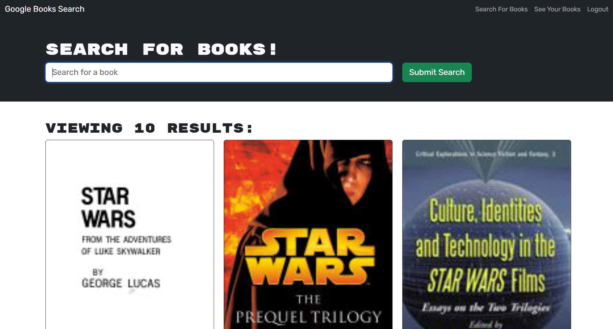

# Online Library

## Description

My motivation for creating this website is to help avid readers find new books to read. This project will help the users be able to keep track on the books
that they have added on their wishlist and be able to keep track on the books. While building this project I learned how to use MongoDB, Express.js, React.js, and Node.js
also known as MEARN. Another thing I learned while deploying was how to use the [MongoDB Atlast](https://www.mongodb.com/) webpage.

## Installation

1. Clone Repo: https://github.com/JosueHernand/Online-Library
2. Open with your code editor and run the following in your terminal `npm i` to install all packages required for the app
3. Then run `npm run start` to start a local browser

## Usage

Website Deployment: [Click Here](https://online-library-ke4e.onrender.com)  

## Credits

[Raymond Bautista](https://github.com/Raymond2811)

## License

Used MIT License
